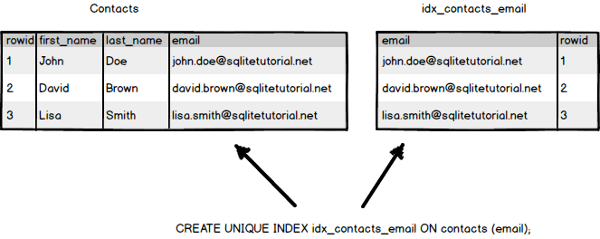

# Indexing

>> Explain the different types of indexing supported by Sqlite, such as B-tree and hash indexes, and their advantages and disadvantages. Discuss how indexing can improve query performance by reducing the number of disk I/O operations needed to access data.cDemonstrate the use of indexing in optimizing queries, with at least two examples, such as finding all orders for a particular customer or finding all products with a specific price.

## SQLite

### What is an index?

In relational databases, a table is a list of rows. In the same time, each row has the same column structure that consists of cells. Each row also has a consecutive rowid sequence number used to identify the row. Therefore, you can consider a table as a list of pairs: (rowid, row).

Unlike a table, an index has an opposite relationship: (row, rowid). An index is an additional data structure that helps improve the performance of a query.



Sqlite includes B-Tree indexes, Hash indexes and R-Tree indexes

- B-tree Indexes: B-tree indexes are the most commonly used index type in SQLite. They work by storing the indexed column values in a tree structure, with each node in the tree containing a range of values and pointers to child nodes. B-tree indexes are efficient for range queries

```sql
SELECT * FROM table WHERE column BETWEEN value1 AND value2
```

as they allow for efficient retrieval of all rows within a specified range. They are also efficient for sorting and ordering data, making them a good choice for ORDER BY queries. However, B-tree indexes can be slow for queries that involve equality comparisons (e.g., SELECT * FROM table WHERE column = value), as the entire index must be searched for a matching value.

- Hash Indexes: Hash indexes work by hashing the indexed column values to generate a unique identifier that is used to look up rows in the table. Hash indexes are very fast for equality comparisons, making them a good choice for queries that involve lookups of a single value (e.g., SELECT * FROM table WHERE column = value). However, hash indexes are not well-suited for range queries or ordering data, as the hash function does not preserve the order of the indexed values.

- R-tree Indexes: R-tree indexes are used for spatial data and allow for efficient searching of geometric data such as points, lines, and polygons. R-tree indexes work by organizing the indexed data into a hierarchical structure of rectangles, with each node in the tree containing a rectangle and pointers to child nodes. R-tree indexes are efficient for range queries and can also support complex queries involving spatial relationships between objects. However, R-tree indexes can be slow to update, as changes to the indexed data require rebuilding the entire index.

### B-tree indexes

The B-tree keeps the amount of data at both sides of the tree balanced so that the number of levels that must be traversed to locate a row is always in the same approximate number. In addition, querying using equality (=) and ranges (>, >=, <,<=) on the B-tree indexes are very efficient.

Each index must be associated with a specific table. An index consists of one or more columns, but all columns of an index must be in the same table. A table may have multiple indexes.

Whenever you create an index, SQLite creates a B-tree structure to hold the index data.

The index contains data from the columns that you specify in the index and the corresponding rowid value. This helps SQLite quickly locate the row based on the values of the indexed columns.

Imagine an index in the database like an index of a book. By looking at the index, you can quickly identify page numbers based on the keywords.


To create an index, you use the CREATE INDEX statement with the following syntax:

```sql
CREATE [UNIQUE] INDEX index_name 
ON table_name(column_list);

```

**Note**: In case you want to make sure that values in one or more columns are unique like email and phone, you use the UNIQUE option in the CREATE INDEX statement. The CREATE UNIQUE INDEX creates a new unique index.


Using a B-tree index for all indexes in SQLite provides several advantages:

Simplicity: Having a single index type simplifies the codebase and reduces the complexity of the SQLite database engine.

Familiarity: Because B-trees are a well-known and widely used data structure, many developers are already familiar with how they work and how to optimize queries that use them.

Flexibility: B-trees are a flexible data structure that can be used to support a wide range of query types, including range queries and exact-match queries.

Efficiency: B-trees are highly efficient for both insertions and lookups, making them a good choice for indexing data in a relational database like SQLite.

Overall, using a B-tree index for all indexes in SQLite provides a simple, flexible, and efficient way to index data and improve query performance.

>> The use of indexing in optimizing queries, with at least two examples, such as finding all orders for a particular customer or finding all products with a specific price.

*** DEMO 4 types of queries ***

### Hash indexes

### R-tree indexes

