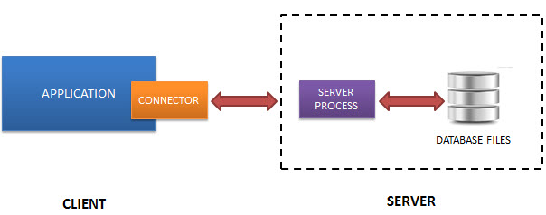

# Introduction

>> Briefly introduce the purpose of the report and the two DBMSs to be discussed, explaining why they were selected and what the report will cover.

## What is SQLite?

SQLite is a software library that provides a relational database management system. The lite in SQLite means lightweight in terms of setup, database administration, and required resources.

SQLite has the following noticeable features: self-contained, serverless, zero-configuration, transactional.

### Serverless

Normally, an RDBMS such as MySQL, PostgreSQL, etc., requires a separate server process to operate. The applications that want to access the database server use TCP/IP protocol to send and receive requests. This is called client/server architecture.

The following diagram illustrates the RDBMS client/server architecture:

SQLite does NOT work this way.

SQLite does NOT require a server to run.

SQLite database is integrated with the application that accesses the database. The applications interact with the SQLite database read and write directly from the database files stored on disk.

The following diagram illustrates the SQLite server-less architecture:

### Self-Contained

SQLite is self-contained means it requires minimal support from the operating system or external library. This makes SQLite usable in any environment especially in embedded devices like iPhones, Android phones, game consoles, handheld media players, etc.

SQLite is developed using ANSI-C. The source code is available as a big sqlite3.c and its header file sqlite3.h. If you want to develop an application that uses SQLite, you just need to drop these files into your project and compile it with your code.

Zero-configuration
Because of the serverless architecture, you don’t need to “install” SQLite before using it. There is no server process that needs to be configured, started, and stopped.

In addition, SQLite does not use any configuration files.

### Others features of Sqlite

- Transactions are atomic, consistent, isolated, and durable (ACID) even after system crashes and power failures.
- Zero-configuration - no setup or administration needed.
- Full-featured SQL implementation with advanced capabilities like partial indexes, indexes on expressions, JSON, common table expressions, and window functions. (Omitted features)
- A complete database is stored in a single cross-platform disk file. Great for use as an application file format.
- Supports terabyte-sized databases and gigabyte-sized strings and blobs. (See limits.html.)
- Small code footprint: less than 750KiB fully configured or much less with optional features omitted.
- Simple, easy to use API.
- Fast: In some cases, SQLite is faster than direct filesystem I/O
- Written in ANSI-C. TCL bindings included. Bindings for dozens of other languages available separately.
- Well-commented source code with 100% branch test coverage.
- Available as a single ANSI-C source-code file that is easy to compile and hence is easy to add into a larger project.
- Self-contained: no external dependencies.
- Cross-platform: Android, *BSD, iOS, Linux, Mac, Solaris, VxWorks, and Windows (Win32, WinCE, WinRT) are supported out of the box. Easy to port to other systems.
- Sources are in the public domain. Use for any purpose.
- Comes with a standalone command-line interface (CLI) client that can be used to administer SQLite databases.

One of the key features of SQLite is its support for indexing, query processing, and query optimization. Indexing is a technique that allows for faster searching and retrieval of data by creating a data structure that maps column values to their corresponding rows in the table. SQLite supports multiple types of indexes, including B-tree, Hash, and R-tree indexes, which can be used to speed up searches and retrievals of data.

Query processing in SQLite involves parsing and analyzing SQL statements, optimizing query plans, and executing queries using various algorithms and techniques. SQLite employs a cost-based query optimizer that uses statistical information about the database and table schema to choose the most efficient query plan. This optimizer takes into account the size and complexity of the tables, the distribution of data in the tables, and the types of operations being performed to determine the most efficient way to execute the query.

Query optimization is an important part of SQLite's query processing capabilities, as it can greatly improve the performance and efficiency of database operations. By optimizing queries, SQLite can reduce the amount of time and resources required to process data, resulting in faster response times and better overall performance.

Overall, SQLite's support for indexing, query processing, and query optimization make it a powerful and efficient tool for managing data in a wide range of applications. Whether you're developing a mobile app, a web application, or an embedded system, SQLite's lightweight architecture and powerful features make it an excellent choice for managing and processing data.
## How about Redshift ?
